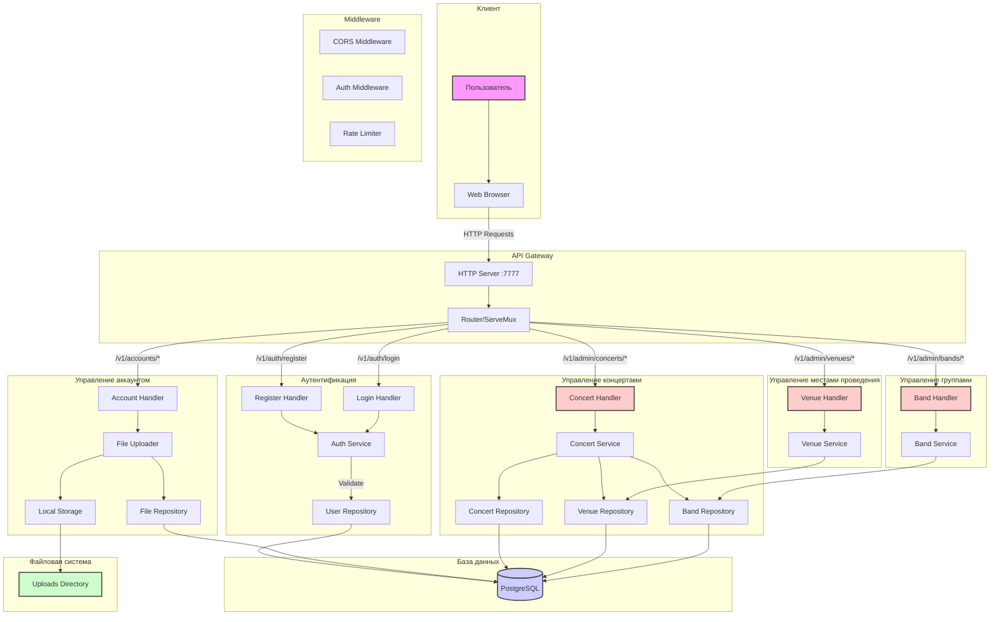

```mermaid
graph TD
    subgraph Клиент
        A[Пользователь] --> B[Web Browser]
    end

    subgraph API Gateway
        B -->|HTTP Requests| C[HTTP Server :7777]
        C --> D[Router/ServeMux]
    end

    subgraph Аутентификация
        D -->|/v1/auth/register| E[Register Handler]
        D -->|/v1/auth/login| F[Login Handler]
        E --> G[Auth Service]
        F --> G
        G -->|Validate| H[User Repository]
    end

    subgraph Управление аккаунтом
        D -->|/v1/accounts/*| I[Account Handler]
        I --> J[File Uploader]
        J --> K[Local Storage]
        J --> L[File Repository]
    end

    subgraph Управление концертами
        D -->|/v1/admin/concerts/*| R[Concert Handler]
        R --> S[Concert Service]
        S --> T[Concert Repository]
        S --> U[Venue Repository]
        S --> V[Band Repository]
    end

    subgraph Управление местами проведения
        D -->|/v1/admin/venues/*| W[Venue Handler]
        W --> X[Venue Service]
        X --> U
    end

    subgraph Управление группами
        D -->|/v1/admin/bands/*| Y[Band Handler]
        Y --> Z[Band Service]
        Z --> V
    end

    subgraph База данных
        H --> M[(PostgreSQL)]
        L --> M
        T --> M
        U --> M
        V --> M
    end

    subgraph Middleware
        N[CORS Middleware]
        O[Auth Middleware]
        P[Rate Limiter]
    end

    subgraph Файловая система
        K --> Q[Uploads Directory]
    end

    style A fill:#f9f,stroke:#333,stroke-width:2px
    style M fill:#ccf,stroke:#333,stroke-width:2px
    style Q fill:#cfc,stroke:#333,stroke-width:2px
    style R fill:#fcc,stroke:#333,stroke-width:2px
    style W fill:#fcc,stroke:#333,stroke-width:2px
    style Y fill:#fcc,stroke:#333,stroke-width:2px
```